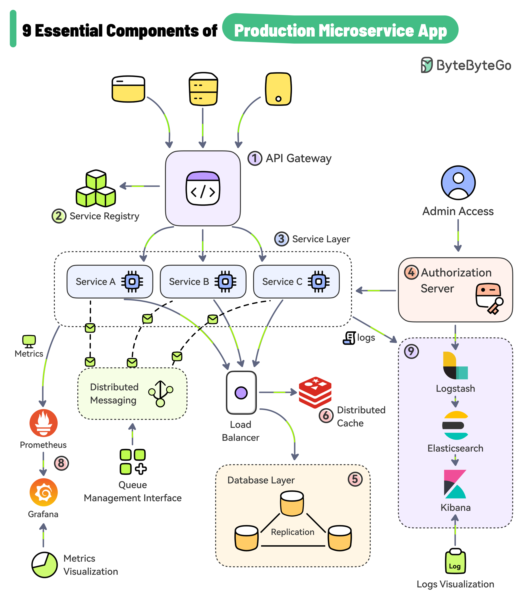

# Documentation Snippets

## Link t o another page

[View Page 1](/docs/modules/multi-pages/page-1)

## Image embedding

### Explainations

1. **API Gateway**
Acts as the **entry point** fro all client traffic. It routes incomming HTTP requests to the appropriate backend service and can also perform cross-cutting concerns like authentication, rate limiting, logging, and request aggregation.
2. **Service Registry**
A dynamic directory of all running service instances. Microservices register themselves here so others can discover them (especially in environments with scaling of dynamic IPs).
3. **Service Layer**
The core bussiness logic components --- individual microservices such as Service A, Service B, etc. Each handles a domain-specific task. They communicate with each other via APIs, gRPC, or messaging.
4. **Authorization Server / Identity Provider**
Manages authentication and authorization. It issues token (e.g JWT/OAuth) and validates user identity and permissions for access control across the system.
5. **Database Layer**
Each microservice often has its own database, encapsulating its data. This ensures loose coupling and helps support scaling, fault isolation, and data ownership.
6. **Distributed Cache**
Used to speed up frequent read operations and reduce load on databases. Caches (like [Redis](https://redis.io/), [Memcached](https://memcached.org/)) may be shared of per service, depending on consistency needs.
7.  **Load Balancer** Distributes traffic across multiple instances of services to ensure availability, blance, and resilience. It improves performance under load.
8. **Metrics / Monitoring / Observability**
Tools like [Prometheus](https://prometheus.io/), [Grafana](https://grafana.com/), or custom metrics collect performance data (latency, throughput, errors). They help teams understand system health, detect anomalies, and alert on issues.
9. **Logging / Search / Visualization (ELK stack etc.)**
Centralized loggin pipeline (e.g. Logstash -> Elasticsearch -> Kibana). Captures logs, enables search and analysis, and allows operators to trace issues, debug, and build dashboards.
